# System Diagrams

Mermaid diagrams of Tara's architecture. Renders natively in GitHub and in VS Code (install the **Markdown Preview Mermaid Support** extension).

If you ever need to share these with someone who can't render Mermaid, paste the code into <https://mermaid.live/> for a PNG/SVG export.

---

## 1. High-level system architecture

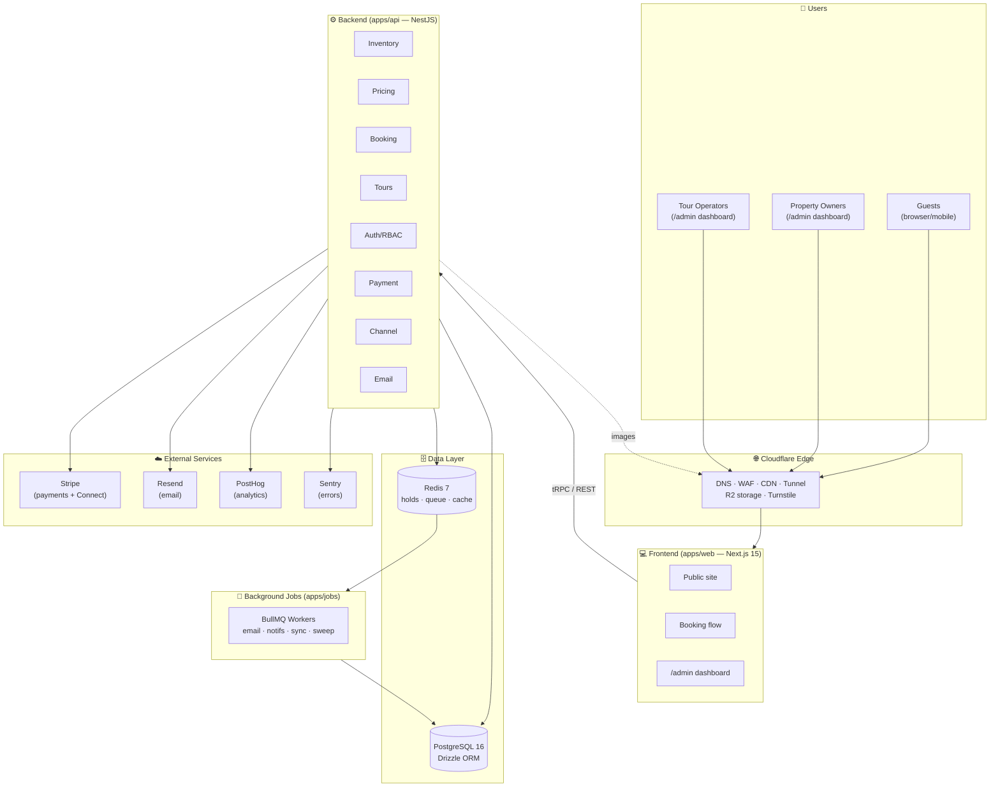

---

## 2. Multi-tenancy / core entity model

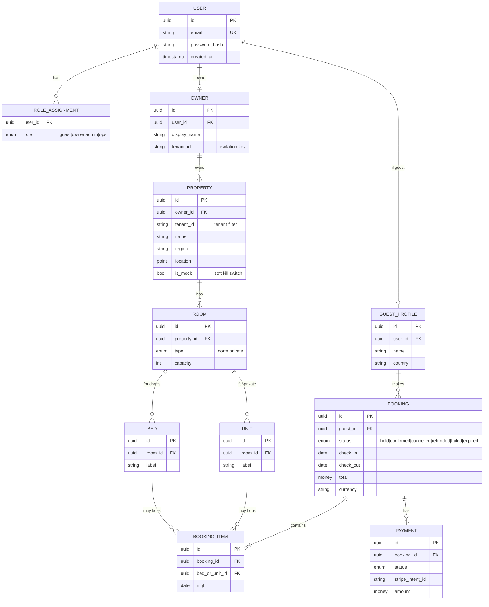

> **Multi-tenancy rule:** every query touching `PROPERTY` and its descendants MUST filter by `tenant_id`. Enforced at the ORM layer via a `withTenant()` wrapper. See ADR-0002.

---

## 3. Booking lifecycle (state machine)

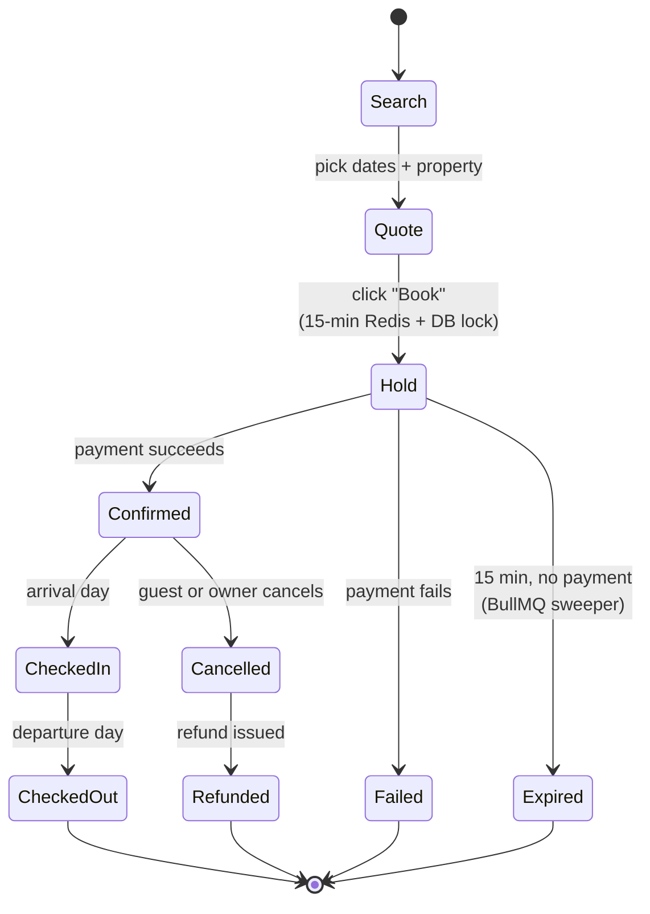

> Every state transition is logged to an append-only `booking_events` table for audit, debugging, and replays.

---

## 4. Deploy pipeline (Windows dev → Ubuntu staging)

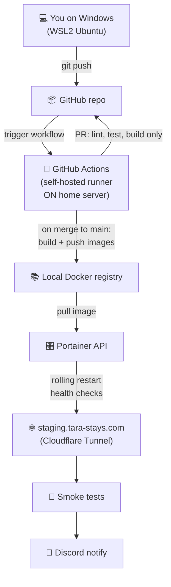

---

## 5. Home server services topology

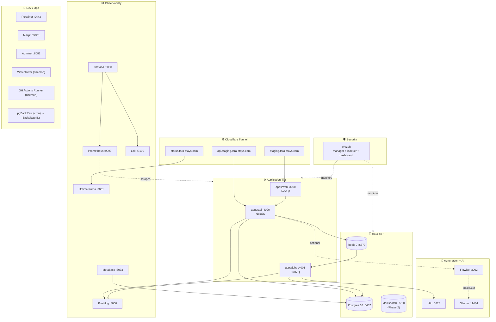

---

## 6. Request flow — a guest booking

```mermaid
sequenceDiagram
  actor Guest
  participant CF as Cloudflare
  participant Web as Next.js (web)
  participant API as NestJS (api)
  participant PG as Postgres
  participant RD as Redis
  participant Stripe
  participant Jobs as BullMQ Worker
  participant Resend

  Guest->>CF: GET /properties?location=zambales
  CF->>Web: forward (cached when possible)
  Web->>API: tRPC: searchProperties
  API->>PG: SELECT with availability filter
  PG-->>API: properties + prices
  API-->>Web: results
  Web-->>Guest: results page

  Guest->>Web: click "Book bed X for nights Y-Z"
  Web->>API: tRPC: createHold
  API->>RD: SET hold:bedX:nightY (NX, EX=900)
  API->>PG: BEGIN; SELECT ... FOR UPDATE bed X; INSERT booking (status=hold); COMMIT
  API-->>Web: hold_id, payment_intent_secret
  Web-->>Guest: payment form

  Guest->>Stripe: submit card details (via Stripe Elements)
  Stripe-->>Guest: 3DS challenge if needed
  Stripe->>API: webhook payment.succeeded
  API->>PG: UPDATE booking SET status=confirmed
  API->>RD: DEL hold:bedX:nightY
  API->>Jobs: enqueue sendConfirmationEmail
  Jobs->>Resend: send booking email
  Resend-->>Guest: 📧 confirmation

  Note over RD,Jobs: If 15 min pass and no payment,<br/>sweeper job releases hold and<br/>marks booking as expired.
```

---

## 7. Tenancy enforcement at the data layer

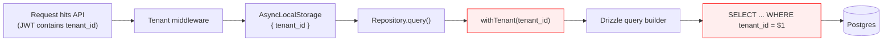

> The red boxes are the only place tenant isolation is enforced. Bypassing them is a P0 bug — covered by tests in `packages/auth/__tests__/tenancy.test.ts`.

---

## 8. Property owner — onboarding journey

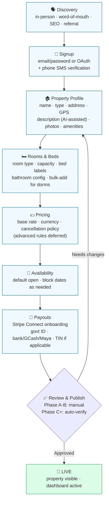

**Two execution paths in practice:**

- **High-touch (Phase B):** Founder sits with the owner in person, drives the flow themselves. 1-2 hours total. Conversion 30-50%.
- **Self-service (Phase C+):** Owner does it alone on phone. Drop-off at every step. Target: 25% completion start-to-finish.

The entire flow must work on mobile — most PH hostel owners do not have a desktop.

---

## 9. Owner dashboard — information architecture

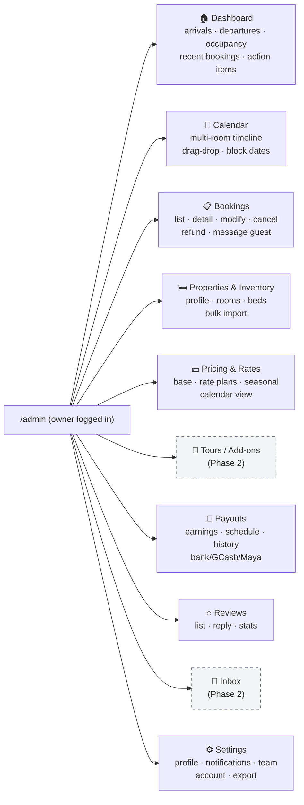

> Dashed boxes are Phase 2. MVP ships everything else.

---

## 10. Owner — receiving a booking (sequence)

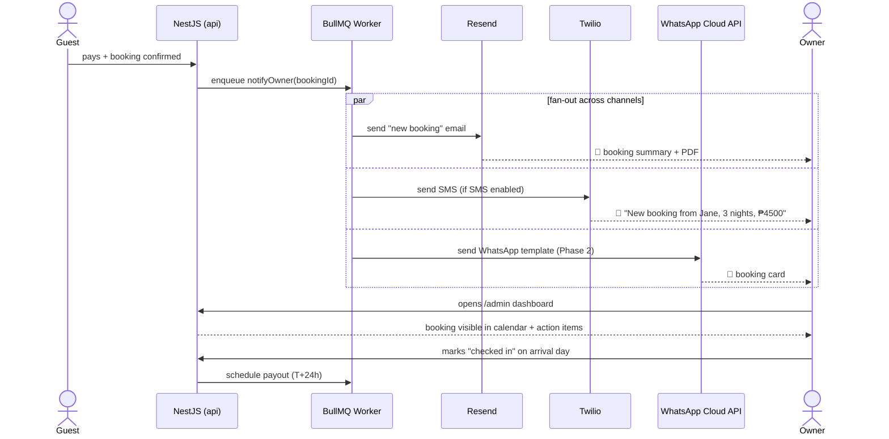

---

## 11. Payout flow (Stripe Connect)

```mermaid
sequenceDiagram
  actor Guest
  participant Stripe as Stripe (platform account)
  participant API as Tara API
  actor Owner
  participant Bank as Owner Bank / GCash / Maya

  Guest->>Stripe: pays ₱5,000 (Stripe Elements)
  Stripe->>API: webhook payment_intent.succeeded
  Note over Stripe: Funds held in Tara's<br/>platform account

  Owner->>API: marks guest checked-in
  API->>API: schedule payout for T+24h<br/>(BullMQ delayed job)

  Note over API,Stripe: After 24h holding period
  API->>Stripe: transfer ₱4,500 to connected account<br/>(minus ₱500 = 10% commission)
  Stripe->>Bank: payout to owner's bank/GCash<br/>(1-2 business days)
  Stripe-->>API: webhook transfer.created
  API-->>Owner: 📧 payout receipt

  alt Cancellation or no-show
    API->>Stripe: refund per cancellation policy
    Note over API,Owner: Partial payout if non-refundable<br/>portion exists
  end

  alt Dispute opened
    Stripe-->>API: webhook charge.dispute.created
    API->>API: freeze payout until resolved
    API-->>Owner: alert: dispute under review
  end
```

---

## 12. Owner lifecycle state machine

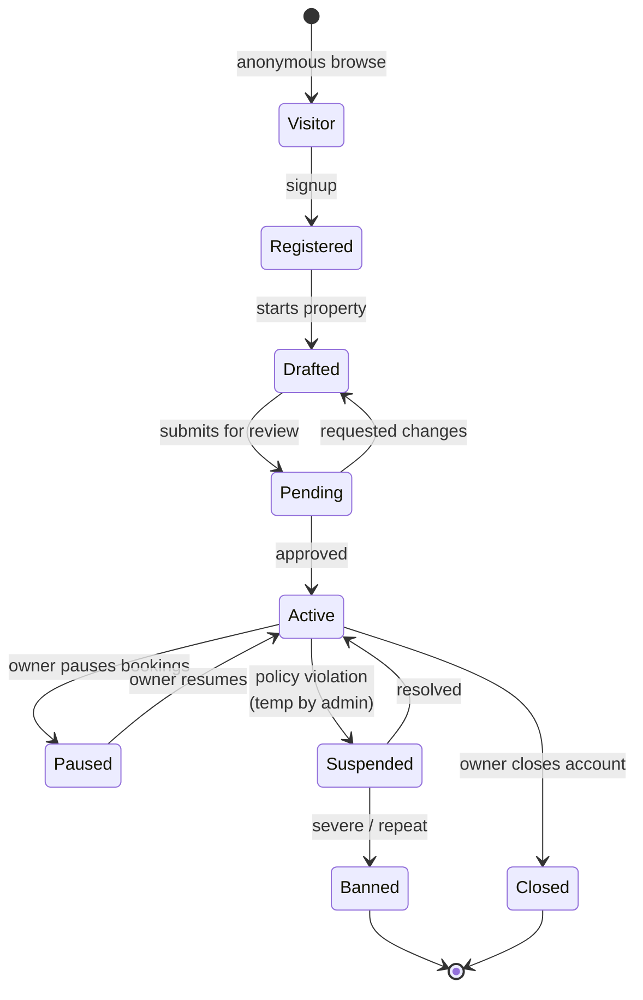

> States drive feature access. Only `Active` properties appear in search. `Paused` properties keep their data but go invisible to guests.

---

## 13. Guest vs Owner — side-by-side journey

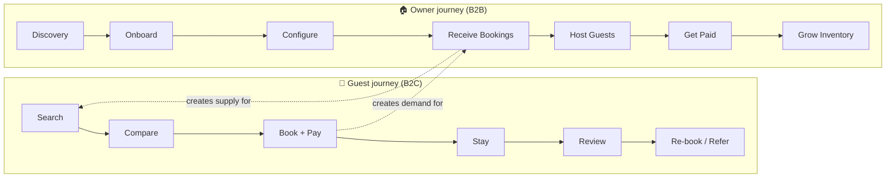

> The two journeys feed each other. This is the network effect — more guests attract more owners attract more guests. Both flywheels must spin or neither does.

---

## 14. Payments architecture — Stripe Connect (Express)

**Decision:** each property owner gets a Stripe **Connected Account** (Express type), managed under Tara's platform account. Tara uses **destination charges** so the platform holds funds during the holding period.

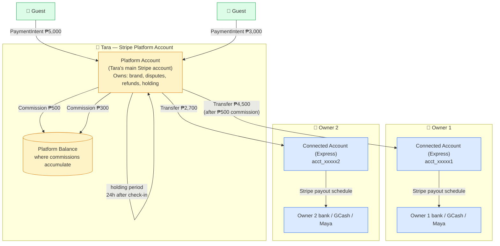

### Why this model

- **Legal:** Stripe is the money transmitter, not Tara. Without Connect, Tara might need money transmitter licenses (US: per state; PH: BSP OPS registration).
- **Holding period:** Tara holds funds 24h after check-in to protect against fraud/no-shows.
- **Disputes:** Centralized on Tara's account; owners aren't burdened with chargebacks.
- **Refunds:** Cancellation policy enforced unilaterally by Tara.
- **Lightweight onboarding:** Express KYC is faster than full Stripe — better completion rates for PH owners.
- **Brand consistency:** Card statements show "TARA" not the owner's business name.
- **Tax reporting:** Stripe handles per-owner 1099-like forms automatically.
- **PH supported:** PHP payouts to local banks/GCash via Stripe Connect since 2024.

### Onboarding flow

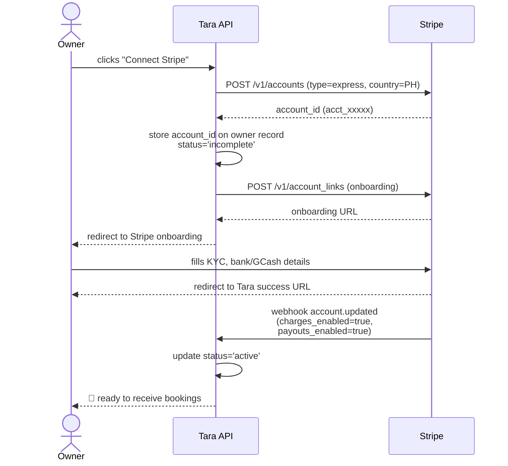

### Fallback for owners who can't pass Stripe KYC (Phase B+)

Some informal PH hostels (no DTI registration, no business bank) won't onboard with Stripe Connect Express. Options:

- **PayMongo Connect** (PH local alternative to Stripe Connect — supports GCash payouts natively)
- **Manual payouts** (Tara holds funds, transfers manually via GCash/InstaPay — higher ops cost, less legally clean)
- **Block until ready** (clean architecture, lose some owners)

**MVP:** Stripe Connect Express only. Add PayMongo as a fallback if real demand materializes.

---

## 15. Notification orchestration (using existing n8n)

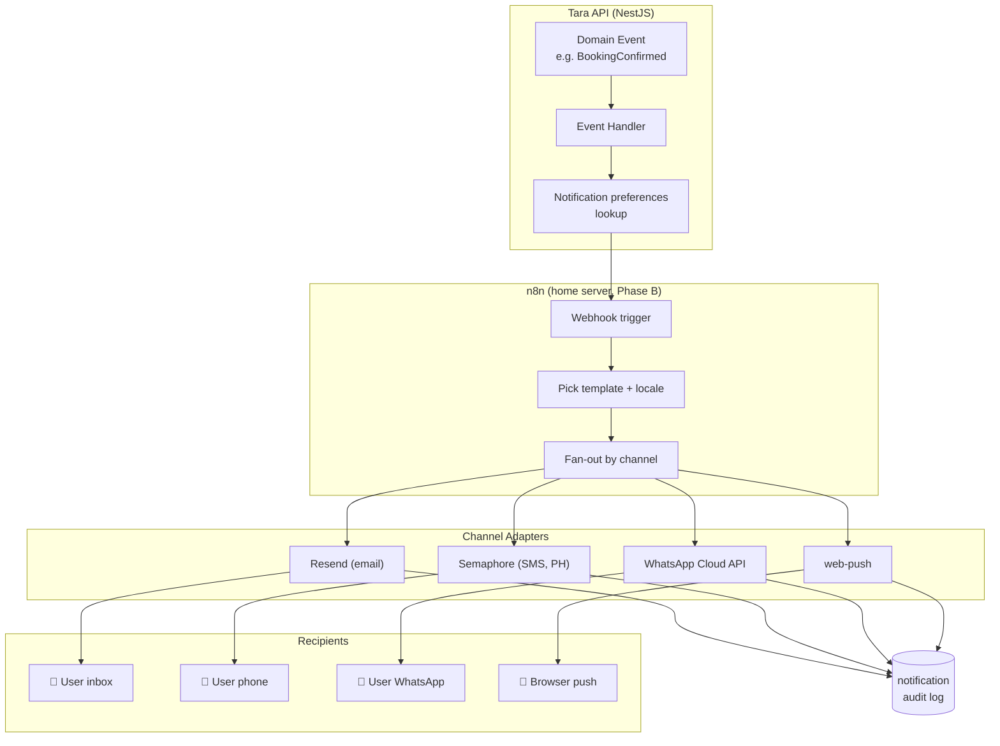

> **Phase B uses n8n** for orchestration — fast to iterate, no deploys. **Phase C/D migrates** to a proper NestJS NotificationModule with BullMQ for stronger guarantees.

---

## 16. Conversation surfaces (Phase B model)

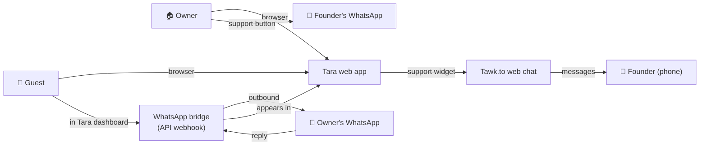

> In Phase B, **WhatsApp is the transport** for owner-side communication. Tara presents a unified inbox in the dashboard. Numbers are masked through Tara's WhatsApp Business number.

---

## Rendering tips

- **In VS Code:** install "Markdown Preview Mermaid Support" extension, then `Cmd/Ctrl+Shift+V` on this file.
- **On GitHub:** renders natively when this file is viewed in the web UI.
- **For exports:** paste any Mermaid block into <https://mermaid.live/> and download as PNG/SVG.

When the architecture changes, **update these diagrams in the same PR.** Diagrams that lie are worse than no diagrams.
